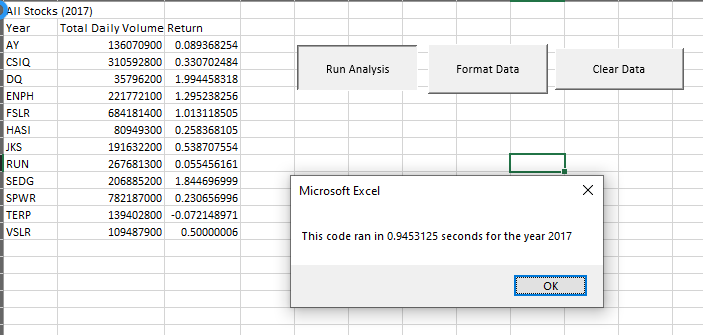
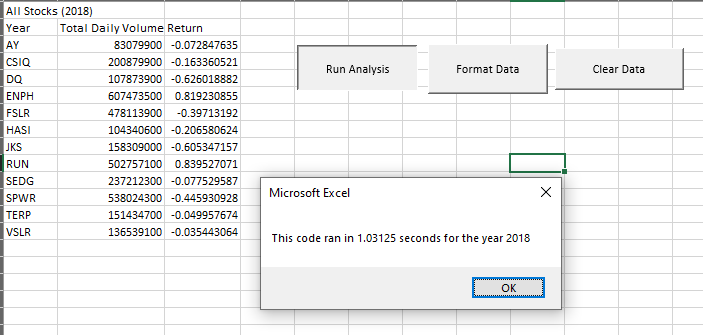

# Module Challenge 2: Stocks Analysis
## Overview of Project
The purpose of this project was to demonstrate the ability to use index values in VBA  to simplify and speed up the analysis process at play in the Stocks Analysis. Doing this will allow future in-depth analysis using this resource to be more effective with potentially larger data sets.

## Results
The original analysis had the following speed times for completion.

### 2017 Original

### 2018 Original

In contrast after refactoring the code 

### 2017 Refactored

### 2018 Refactored

## Summary
